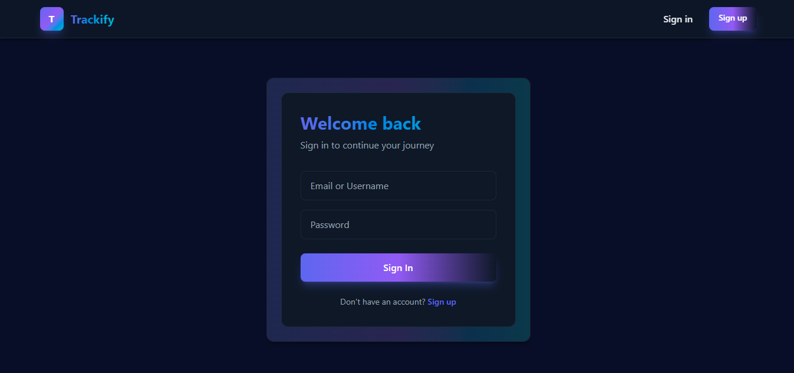
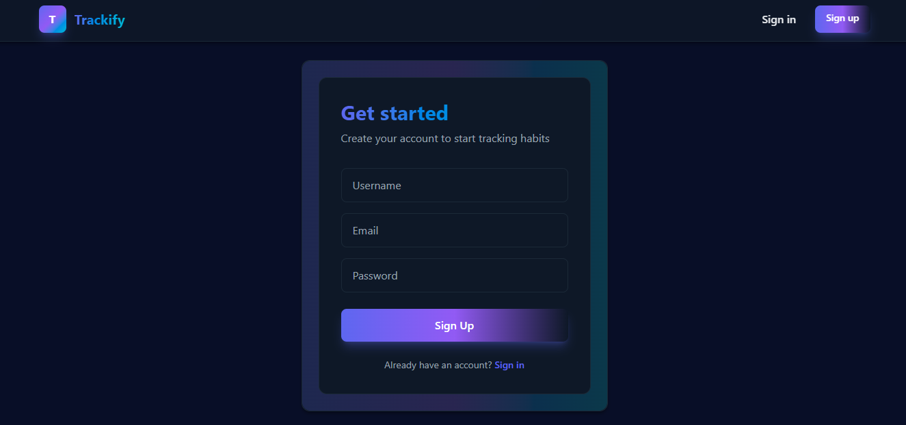
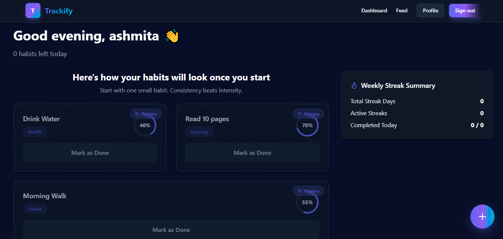
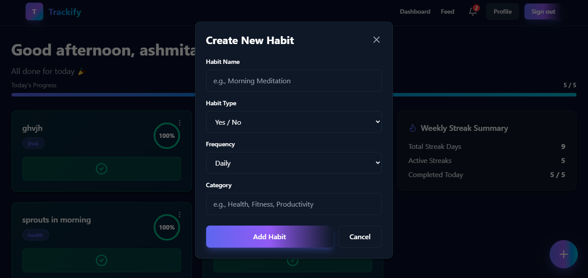
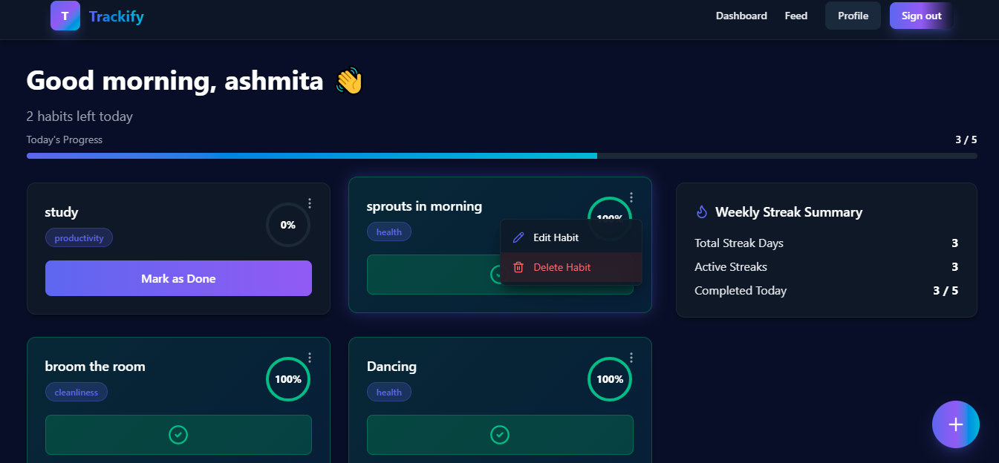
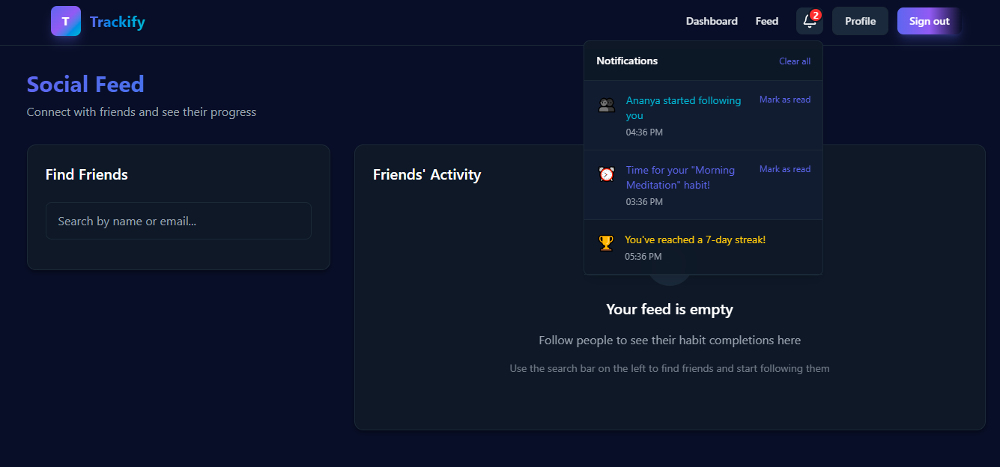
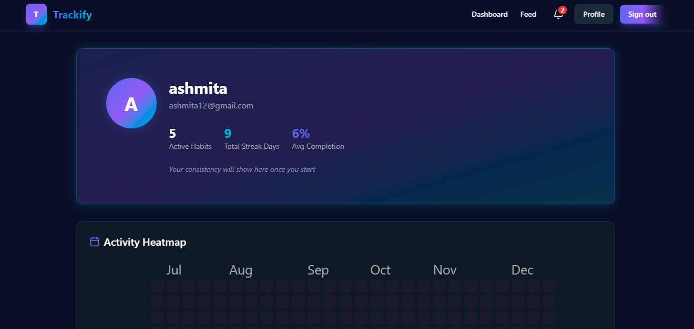
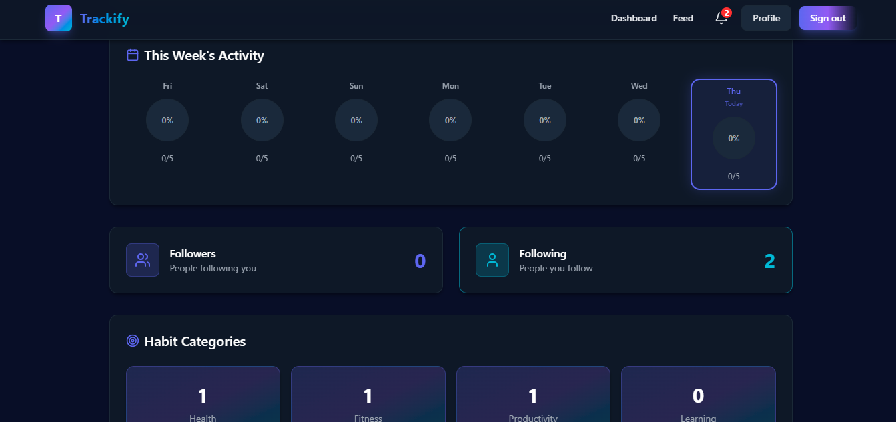

# ✍️ Trackify  

> A full-stack habit tracker that helps users **build consistency, stay motivated, and grow together** through daily habits, streaks, and social accountability.

---

## 📌 Overview

**Trackify** is a **full-stack web app** that combines personal habit tracking with social features.  
Users can create habits, check in daily, track streaks, follow friends, and see activity feeds to stay motivated.

This repository contains the **frontend and backend** built using **React, Node.js, Express, MongoDB, and JWT**.

---

## 🚀 Features

- 🔐 **Authentication** – Register/Login with JWT  
- ✅ **Habit Management** – Create, edit, delete, and check-in habits  
- 🔥 **Daily Streaks** – Track progress and streak counters  
- 👥 **Social Features** – Follow/unfollow users  
- 📰 **Personalized Feed** – View activity from followed users  
- 👤 **Profile Page** – Track habits, streaks, and recent activity  

---

## 🖼️ Screenshots

### Frontend UI

#### Authentication
<p align="center">
  
  
</p>

#### Dashboard
<p align="center">
  
  
  
</p>

#### Feed & Profile
<p align="center">
  
  
  
</p>


---

## 🛠️ Tech Stack

- **Frontend:** React (Vite/CRA), Tailwind CSS, Axios  
- **Backend:** Node.js, Express, MongoDB (Mongoose), JWT  
- **Deployment:** Frontend → Vercel, Backend → Render, Database → MongoDB Atlas  

---

## ▶️ Run Locally

```bash
# Clone repository
git clone https://github.com/dipanshi8/Trackify.git
cd Trackify

# Backend setup
cd backend
npm install
# Create .env with PORT, MONGO_URI, JWT_SECRET, FRONTEND_URL
npm start

# Frontend setup
cd ../frontend
npm install
# Create .env with REACT_APP_API_URL=http://localhost:5000/api
npm start
